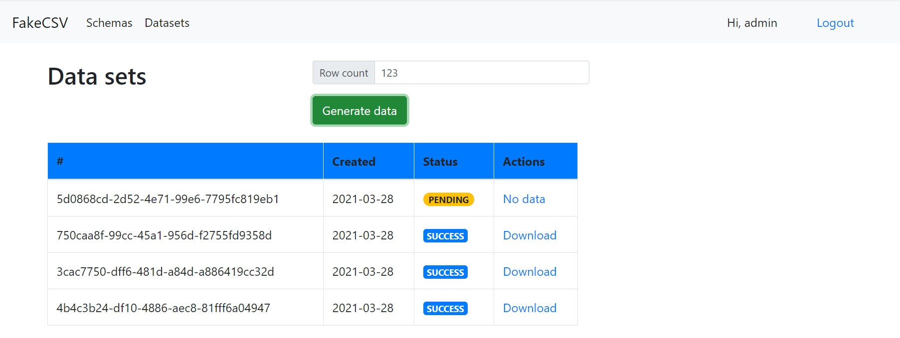

<h1 align="center">The Challenge</h1> 

## Table of contents
* [General info](#general-info)
* [Technologies](#technologies)
* [Setup](#setup)
* [Deploy](#deploy)

## General info
Online service for generating CSV files with fake(dummy) data using Python and Django



## Technologies
Project is created with:
* Python 3
* Django
* Bootstrap
* Celery
* Redis
* Heroku
* AWS S3
	
## Setup
To run this project, install it locally using pip:

```
pip install -r requirements.txt 
python manage.py makemigrations
python manage.py migrate
```
#### Redis:
[Download Redis 5.0.10](https://github.com/tporadowski/redis/releases)

#### Run Celery (locally, tested on Windows 10):
```
celery -A core worker --pool=gevent --loglevel=info
```

## Deploy

Heroku commands:
```
heroku login
heroku create <your_name>
heroku config: set KEY=VALUE
git push heroku master
```

Up Celery worker
```
heroku ps:scale worker=1
heroku logs -t -p worker
```
